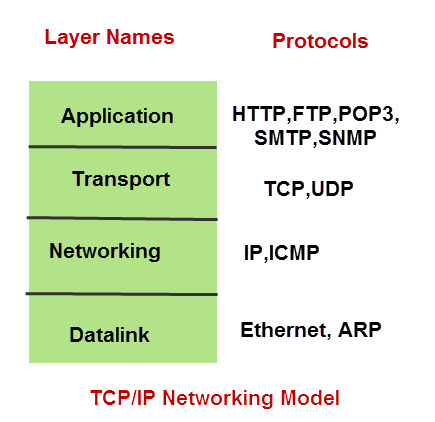

### TCP/IP

TCP/IP四层协议模型：数据链路层、网络层、传输层、应用层

### HTTP特性

* Hypertext Transfer Protocol (HTTP) 超文本传输协议
* HTTP是一个应用层协议
* 它被用作传输超媒体文档，例如 HTML。
* HTTP 协议基于经典的 CS 通信模式，客户端打开一个连接请求，等待服务器的响应。
* HTTP 是一个无状态协议，它不会在两次请求之间保存任何数据。

### HTTP概述

>
> 参考： https://developer.mozilla.org/en-US/docs/Web/HTTP
>

HTTP用来获取像HTML文档这样的资源，它是在互联网上交换数据的基础并且是一个客户端-服务器协议，由信息的接受者发起请求，通常来说是浏览器。一个完整的文档
由获取到的不同子文档重新组合而成，例如：文本、样式描述、图片、视频、脚本等等。

客户端和服务器之间通过交换独立的信息进行通信（和数据流stream相对应）。客户端（通常情况下是浏览器）发送的消息被称为请求，服务器发送的消息称为响应。

HTTP在20世纪90年代被开发出来，它是一个具备良好扩展功能的协议，而且在不断的发展。它是一个应用层协议，可以基于TCP连接也可以基于TLS加密的TCP连接，
并且理论上任何可靠的传输层协议都可以被它使用。因为它的可扩展性能，它不光被用来获取超文本，而且可以用来获取图片、视频，或者post内容到服务器，
比如通过HTML的表单。HTTP也可以用来获取部分文档来按需更新局部页面。

### 基于HTTP的系统

HTTP是客户端-服务器协议：请求由一个叫 user-agent 的实体发出，或者一个代理。通常user-agent是浏览器，但是也可以是类似机器爬虫的任何东西。

任何独立的请求都会被发送到服务器，服务器会处理请求并且准备响应。在请求和响应之间还有很多实体，可能是执行特定功能的代理，比如是一个网关或者缓存，
等等。

真实情况下，有更多的计算机参与浏览器和服务器之间处理请求：比如路由器、调制解调器等等。正因为有分层的互联网设计，这些计算机都被隐藏在网络层传输层。
HTTP在它们之上的应用层工作。尽管在检测网络故障方面很重要，但是这些隐藏在下面的层对于解释HTTP协议来说非常的无关紧要。

#### 客户端：user-agent

