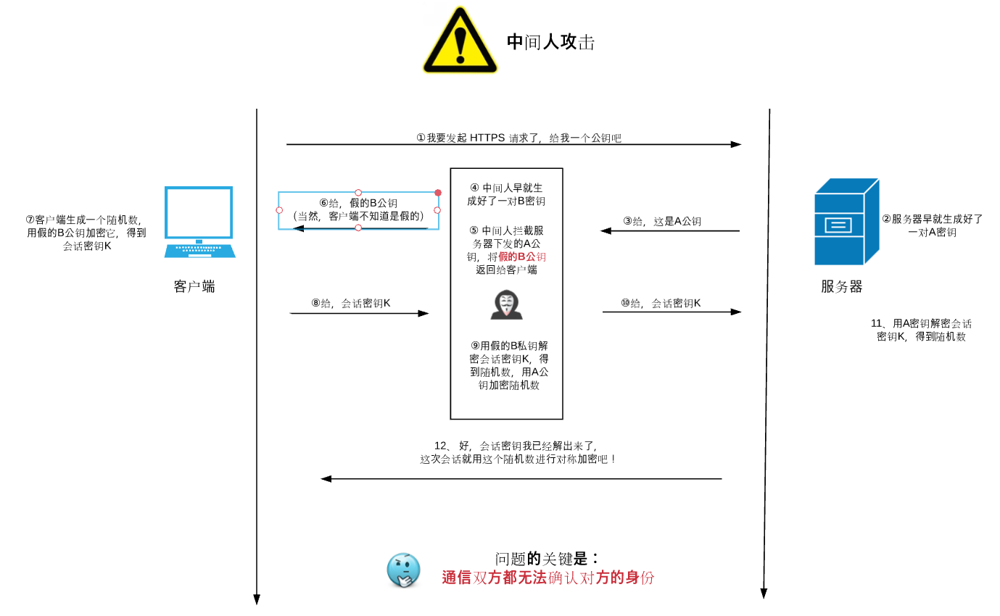
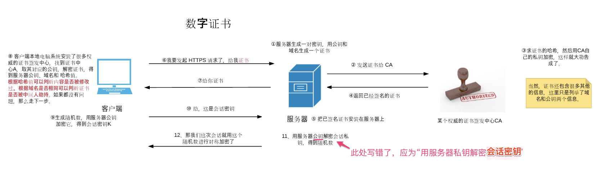

### Let's get to know HTTPS

> 图解HTTPS https://github.com/youngwind/blog/issues/108

> TSL/SSL http://www.ruanyifeng.com/blog/2014/02/ssl_tls.html

#### SSL/TLS

HTTP协议使用明文传输数据，导致了网络间数据传输有三大风险

* 窃听风险（eavesdropping）：第三方可以获知通信内容
* 篡改风险（tampering）：第三方可以修改通信内容
* 冒充风险（pretending）：第三方可以冒充他人身份参与通信

SSL/TLS 协议更加安全，具备以下特性

* 所有信息都是加密传播，第三方无法窃听。
* 具有校验机制，一旦被篡改，通信双方会立刻发现。
* 配备身份证书，防止身份被冒充

> 数字签名是什么？  http://www.ruanyifeng.com/blog/2011/08/what_is_a_digital_signature.html

一步一步来看 TLS/SSL 如何保证网络传输的安全。
为了保证传输过程中数据的安全，可以对传输的数据加密，加密分为 对称加密 和非对称加密两种方式。

单纯使用对称加密产生的问题是密钥传输过程其实是不安全的

因此可以使用非对称加密的方式传输密钥 

但是依然存在的问题是，中间人可以通过劫持客户端和服务器的请求并分别对彼此冒充对方

因此，数字证书就派上了用场

类似 charls/fiddler 等抓包工具抓取 HTTPS 的过程其实也是一个请求劫持的过程
不同之处在于，客户端已经提前安装并且信任了它们的证书

